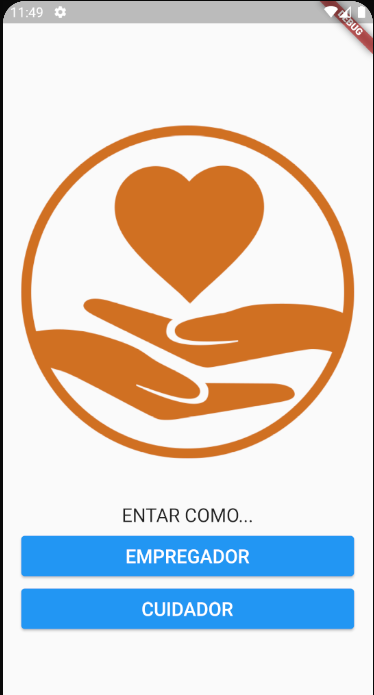
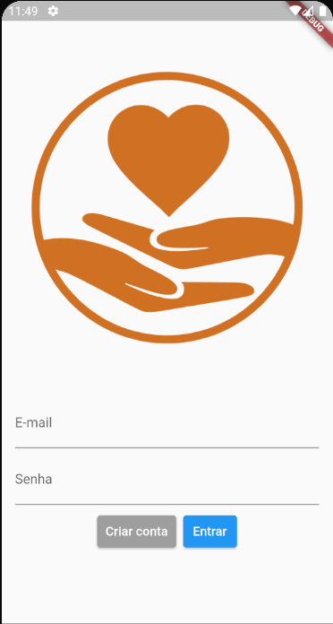
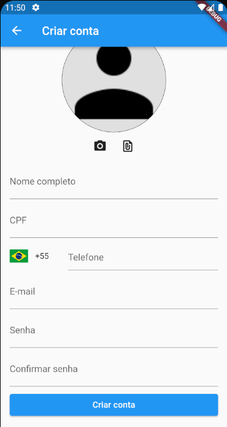
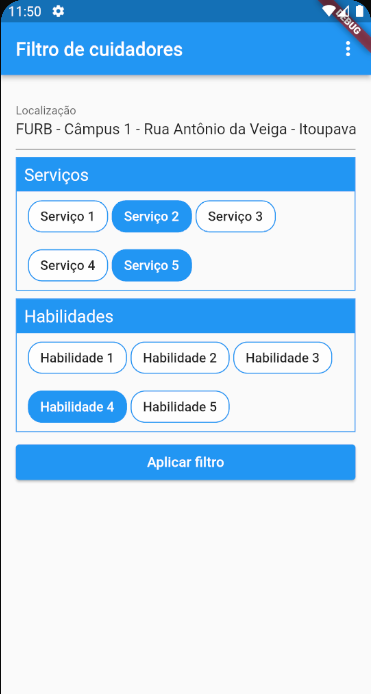
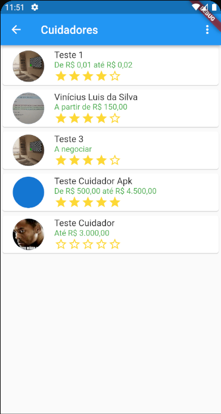
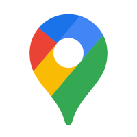

# CaregiverHub

The caregiver hub is a app built to facilitate the communication and negotiation of elderly caregiving jobs between interested parties. Let's say that you have someone important to you that needs special care, and you need to attend a social event at some night and you don't know anybody that can help you with your someone that needs special attention. That's where this app comes in, offering a variety of caregivers that work near and can help you for a price.

This app has several useful features such as:
- Authentication;
- Geografic filtering;
- Job negotiations;
- Caregiver recommendations;
- Live chat;
- Integration with e-mail and whatsapp;
- Notifications;
- and so much more.

## Showcase

## Authentication

The authentication screen is divided in two. The first one show a option for user to login as employer (Empregador) of as a caregiver (Cuidador).

This is mainly a cosmetic option as the user can switch between the two whenever he wants inside the app.

The second screen is the main login screen, requesting the user email and password, or allowing him to create a account.

If he chooses to create a account, he is taken to this other screen where he can fil out is basic information (Name, e-mail, password, phone number, registration number and a photo that he can take or upload from the filesystem).

## Caregiver filtering

The filtering process can be done by filling out some fields that help the use find a caregiver near by that can do the job. The filter can be done by choosing the services provided, the skills required and the location where the job is going to take place. The location o mandatory to fill out, so the filtering does not include caregivers from completely different locations.

Filtering screen:

Caregiver listing screen:

Caregiver profile animations:

## Caregiver acting place

A user can become a caregiver by editing it's profile and activating the flag "show my profile as caregiver". The user in doing that has to choose a location and a radius where he is going to be taking jobs, and he can also list he's skills, services provided and price range to be hired.

Showcase video:

## Job negotiation

The negotiation between two parties can be done in the app. This is achieved by allowing the user and the caregiver to edit the same job details form, and making them both agree on the terms. Meanwhile, they can discuss details of the job in the chat provided by the app. Whenever there are changes to the negotiation, new messages on the chat, one of them cancels the job or both of them agree on the terms, a notification is sent to the required parties.

Showcase video:

## Caregiver recomendation

After a job is completed, the user can recommend the caregiver, writing a recomendation and giving him a rating between 1 and 5 stars. An avarage rating for the caregiver is calculated using a cloud function on firebase.

Showcase video:

### Tech stack

The tech stack was a really simple yet powerful one. Firebase was used in the backend, each by itself already provided the realtime database needed for storing the data and creating the chat application with little effort. Firebase was also resposible for authentication, file storage and running the needed cloud functions to process data updates that ecoed changes in different documents, such as the caregiver location and caregiver recomendations.

Still in the backend, it was needed to create a google cloud platform to activate the google places API needed for the project.

In the frontend it was used flutter, the star child of this project. It was chosen a Domain Driven Design aproach to develop the source code of the project, wich was really helpful to keep the code clear and concise.
